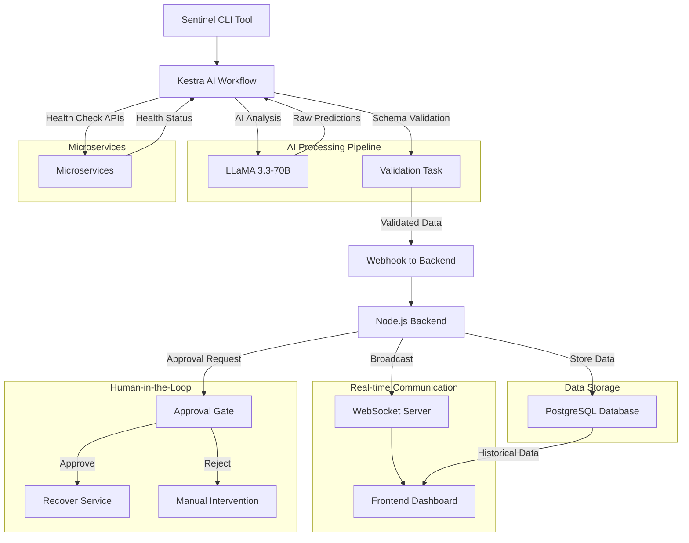
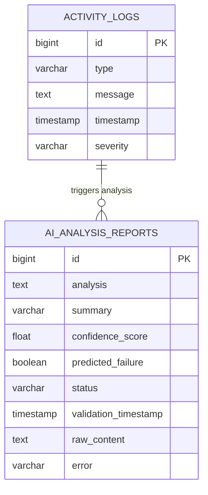

# Sentinel Architecture Documentation

## 🎯 High-Level Overview

**Sentinel** is an autonomous DevOps intelligence agent that provides 24/7 infrastructure monitoring, predictive failure detection, and automatic healing capabilities. The system operates as a self-sufficient monitoring solution that never sleeps, ensuring your infrastructure remains healthy and responsive.

### Core Philosophy
- **Autonomous Operation**: Minimal human intervention required
- **Predictive Intelligence**: AI-powered failure prediction using advanced machine learning
- **Real-Time Response**: Instant detection and healing of infrastructure issues
- **Human-in-the-Loop**: Critical healing actions require human approval via `/api/approvals/pending` endpoint
- **Scalable Architecture**: Built to handle enterprise-grade workloads

## 🛠️ Technology Stack

### Backend Technologies
- **Node.js 18+**: Runtime environment for the backend API server
- **Express.js**: Web framework for REST API endpoints
- **WebSocket**: Real-time bidirectional communication for live updates
- **PostgreSQL**: Primary database for activity logs and AI analysis reports
- **Docker**: Containerization for consistent deployment environments

### Frontend Technologies
- **Next.js 16**: React framework with server-side rendering
- **Vercel**: Deployment platform for optimal performance
- **Tailwind CSS**: Utility-first CSS framework for responsive design
- **Framer Motion**: Animation library for smooth user interactions
- **Lucide React**: Icon library for consistent UI elements

### Orchestration & AI
- **Kestra**: Workflow orchestration platform for AI processing pipelines
- **Groq LLaMA 3.3-70B**: Large language model for predictive analytics
- **Schema Validation**: Robust JSON validation to prevent AI hallucinations

### Development & Deployment
- **Docker Compose**: Multi-container orchestration for local development
- **GitHub Actions**: CI/CD pipelines for automated testing and deployment
- **Grafana**: Monitoring and observability dashboard
- **Sentinel CLI**: Command-line interface for system management

## 🏗️ Core Components

### 1. Sentinel CLI Tool
**Location**: `cli/`

The command-line interface provides direct interaction with the Sentinel system for administrators and DevOps engineers.

**Key Features**:
- **System Status**: Real-time health monitoring of all services
- **Service Healing**: Manual triggering of auto-healing procedures
- **Failure Simulation**: Controlled testing of failure scenarios
- **Configuration Management**: System configuration and tuning

**Commands**:
```bash
sentinel status          # Check system health
sentinel heal <service>  # Heal specific service
sentinel simulate <mode> # Simulate failure scenarios
```

### 2. Kestra AI Workflows
**Location**: `kestra-flows/intelligent-monitor.yaml`

The orchestration layer that manages AI-powered monitoring and predictive analysis workflows.

**Key Capabilities**:
- **Parallel Health Checks**: Simultaneous monitoring of all microservices
- **AI Predictive Analysis**: LLM-powered failure prediction with confidence scoring
- **Schema Validation**: Robust validation to prevent AI hallucination issues
- **Automated Healing**: Trigger-based service recovery procedures

**Workflow Stages**:
1. **Health Data Collection**: Parallel API calls to all services
2. **AI Analysis**: Process data through LLaMA 3.3-70B model
3. **Schema Validation**: Ensure AI output meets strict type requirements
4. **Result Broadcasting**: Send validated data to backend via webhooks
5. **Dashboard Updates**: Real-time frontend updates via WebSockets

### 3. Node.js Backend Server
**Location**: `backend/`

The central API server that handles all system communications, data processing, and real-time broadcasting.

**Core Responsibilities**:
- **WebSocket Server**: Real-time communication with frontend dashboard
- **API Endpoints**: RESTful APIs for webhook ingestion and system management
- **Database Operations**: PostgreSQL integration for persistent storage
- **Graceful Shutdown**: Proper resource cleanup and service termination
- **Security**: Environment validation and secure secret management

**Key Modules**:
- **WebSocket Broadcasting**: Real-time updates to connected clients
- **Database Layer**: Activity logs and AI report storage
- **API Routes**: Health checks, webhook ingestion, system management
- **Security Middleware**: Environment validation and authentication

### 4. Real-Time Frontend Dashboard
**Location**: `sentinel-frontend/`

Modern React-based dashboard providing real-time visualization of infrastructure health and AI predictions.

**Features**:
- **Live Monitoring**: Real-time service health indicators
- **AI Predictions**: Confidence scores and failure predictions
- **Historical Data**: Activity logs and trend analysis
- **Interactive Controls**: Manual healing triggers and configuration
- **Responsive Design**: Optimized for desktop and mobile devices

**Technical Implementation**:
- **Next.js App Router**: Modern routing and server-side rendering
- **WebSocket Integration**: Real-time data updates without page refresh
- **Component Architecture**: Modular, reusable React components
- **State Management**: Zustand for efficient state handling

### 5. Microservices Architecture
**Location**: `services/`

Distributed services that demonstrate the monitoring capabilities and provide realistic test scenarios.

**Available Services**:
- **Auth Service** (Port 3001): Authentication and authorization
- **Payment Service** (Port 3002): Payment processing simulation
- **Notification Service** (Port 3003): Notification system simulation

**Service Features**:
- **Health Endpoints**: Standardized health check APIs
- **Failure Simulation**: Configurable failure modes for testing
- **Graceful Shutdown**: Proper container termination handling
- **Docker Optimization**: Efficient container builds with layer caching

## 🔄 Data Flow Architecture

The Sentinel system follows a sophisticated data flow pattern that ensures real-time monitoring and predictive analysis:

### System Data Flow



### Monitoring Pipeline
1. **Service Health Collection**: Kestra workflows poll all microservices
2. **AI Processing**: Health data analyzed by LLaMA 3.3-70B model
3. **Schema Validation**: Strict type checking and data sanitization
4. **Backend Processing**: Results processed and stored in PostgreSQL
5. **Real-time Broadcasting**: WebSocket updates sent to frontend
6. **Dashboard Display**: Live visualization of system health and predictions

### Communication Patterns
- **REST APIs**: Standard HTTP requests for webhook data ingestion
- **WebSockets**: Persistent connections for real-time updates
- **CLI Integration**: Direct system interaction via command line
- **Inter-Service Communication**: Docker network-based service communication

## 🗄️ Database Schema Overview

### Primary Tables Structure



### Table Descriptions

#### `activity_logs`
Stores comprehensive system events and monitoring data for audit trails and historical analysis.

**Columns**:
- `id` (bigint, Primary Key): Unique identifier for each log entry
- `type` (varchar): Log category (info, success, warn, alert, error)
- `message` (text): Detailed log message describing the event
- `timestamp` (timestamp): When the event occurred
- `severity` (varchar): Event severity level for filtering and alerting

#### `ai_analysis_reports`
Contains validated AI predictions with confidence scores and metadata for predictive analysis.

**Columns**:
- `id` (bigint, Primary Key): Unique identifier for each AI report
- `analysis` (text): Full AI analysis text from the language model
- `summary` (varchar): Concise summary of the AI prediction
- `confidence_score` (float): Validated confidence score (0.0-1.0)
- `predicted_failure` (boolean): Whether failure is predicted
- `status` (varchar): Validation status (valid, validation_failed)
- `validation_timestamp` (timestamp): When the prediction was validated
- `raw_content` (text): Raw AI output before validation
- `error` (varchar): Error message if validation failed

### Schema Validation Rules

The system implements strict schema validation to ensure data integrity:

```javascript
// Validation Rules Applied
{
  "confidence_score": {
    "type": "number",
    "range": [0.0, 1.0],
    "required": true
  },
  "predicted_failure": {
    "type": "boolean", 
    "required": true
  },
  "status": {
    "type": "string",
    "enum": ["valid", "validation_failed"],
    "required": true
  }
}
```

### Data Flow Persistence

1. **Event Capture**: All system events are logged to `activity_logs`
2. **AI Processing**: Validated predictions stored in `ai_analysis_reports`
3. **Historical Analysis**: Long-term trending and capacity planning
4. **Audit Trail**: Complete record of system actions and AI decisions

## 🛡️ Security & Reliability

### Security Measures
- **Environment Validation**: Secure secret management in production
- **Input Sanitization**: Comprehensive validation of all incoming data
- **Schema Validation**: Protection against AI hallucination and malformed data
- **Graceful Error Handling**: Comprehensive error recovery mechanisms

### Reliability Features
- **Graceful Shutdown**: Proper resource cleanup on service termination
- **Memory Management**: WebSocket connection cleanup and memory leak prevention
- **Docker Optimization**: Efficient container builds with layer caching
- **Fail-Safe Mechanisms**: Fallback values for AI prediction failures

## 📊 Monitoring & Observability

### System Metrics
- **Service Health**: Real-time status of all monitored services
- **AI Confidence**: Prediction confidence scores and accuracy metrics
- **Performance Metrics**: Response times and system resource usage
- **Error Tracking**: Comprehensive error logging and alerting

### Data Persistence
- **Activity Logs**: Historical record of all system events
- **AI Analysis Reports**: Validated AI predictions with metadata
- **Performance Data**: Long-term trending and capacity planning
- **Audit Trail**: Complete record of system actions and changes

## 🚀 Deployment Architecture

### Container Strategy
- **Docker Compose**: Local development environment orchestration
- **Multi-Stage Builds**: Optimized container images for production
- **Health Checks**: Container health monitoring and automatic recovery
- **Resource Limits**: Controlled resource allocation for stability

### Scalability Considerations
- **Horizontal Scaling**: Load balancing for backend services
- **Database Optimization**: Connection pooling and query optimization
- **WebSocket Scaling**: Connection management for high-concurrency scenarios
- **AI Processing**: Batch processing and queue management for AI workflows

---

## 📚 Additional Resources

- [API Documentation](./docs/API.md) - Detailed API reference
- [Development Guide](./docs/DEVELOPMENT.md) - Setup and development instructions
- [Contributing Guide](./CONTRIBUTING.md) - How to contribute to the project
- [Security Policy](./docs/SECURITY.md) - Security guidelines and disclosure

---

*This architecture documentation is continuously updated to reflect the evolving nature of the Sentinel system. For the most current information, please refer to the latest version in the main repository branch.*