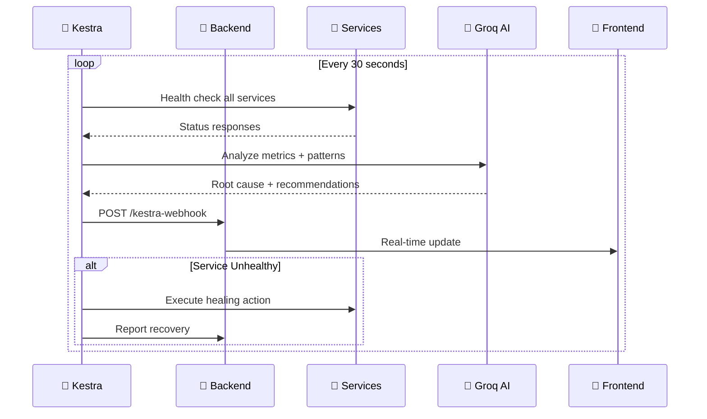

<div align="center">

<!-- Animated Header Banner -->


<br/>

### ✨ *Your Infrastructure Never Sleeps. Neither Does Sentinel.* ✨

<br/>

<!-- Hero Badges Row 1 - Status -->
[](https://wemakedevs.org)
[](https://apertre.org)
[](LICENSE)

<!-- Hero Badges Row 2 - Tech -->
[](https://nextjs.org/)
[](https://www.typescriptlang.org/)
[](https://kestra.io/)
[](https://groq.com/)

<!-- Hero Badges Row 3 - Tools -->
[](https://docker.com/)
[](https://tailwindcss.com/)
[](https://coderabbit.ai)
[](https://vercel.com)

<br/>

<!-- Quick Links -->
[**🚀 Live Demo**](https://sentinel-devops.vercel.app) &nbsp;•&nbsp;
[**📊 Dashboard**](https://sentinel-devops.vercel.app/dashboard) &nbsp;•&nbsp;
[**🎮 Interactive Demo**](https://sentinel-devops.vercel.app/demo) &nbsp;•&nbsp;
[**🎥 Video Demo**](https://youtu.be/VlqGomVrFzQ) &nbsp;•&nbsp;
[**📚 Docs**](DOCUMENTATION.md)

<br/>

<!-- Social Stats -->
<a href="https://github.com/SKfaizan-786/sentinel-devops-agent/stargazers"></a>
<a href="https://github.com/SKfaizan-786/sentinel-devops-agent/network/members"></a>
<a href="https://github.com/SKfaizan-786/sentinel-devops-agent/watchers"></a>

</div>

<br/>

<!-- Animated Divider -->


<br/>

## 🎬 What is Sentinel?

<table>
<tr>
<td width="60%">

**Sentinel** is an **autonomous AI-powered DevOps agent** that transforms infrastructure management from reactive firefighting to proactive, self-healing operations.

### The Problem We Solve
- ❌ Engineers woken at 3 AM to restart services
- ❌ Alert fatigue from too many notifications  
- ❌ Problems fixed only after users complain

### Sentinel's Solution
- ✅ 24/7 autonomous monitoring & healing
- ✅ AI-powered root cause analysis
- ✅ Self-healing within 30 seconds
- ✅ Transparent reasoning for every action

**Featured in the top projects** at WeMakeDevs AI Agents Assemble Hackathon with 6,000+ teams competing worldwide.

</td>
<td width="40%">

<div align="center">

```
┌─────────────────────────────────┐
│     🛡️ SENTINEL AGENT          │
├─────────────────────────────────┤
│                                 │
│   ┌─────┐  ┌─────┐  ┌─────┐    │
│   │ 🟢  │  │ 🟢  │  │ 🔴  │    │
│   │Auth │  │ Pay │  │Notif│    │
│   └──┬──┘  └──┬──┘  └──┬──┘    │
│      │       │        │        │
│      └───────┼────────┘        │
│              ▼                 │
│        ┌─────────┐             │
│        │ 🤖 AI   │ ← Analyze   │
│        │ Engine  │             │
│        └────┬────┘             │
│             ▼                  │
│      ✨ AUTO-HEAL ✨           │
│                                 │
└─────────────────────────────────┘
```

</div>

</td>
</tr>
</table>

<br/>

## ✨ Key Features

<div align="center">

| | Feature | Description |
|:-:|:-------:|:------------|
| 🔍 | **24/7 Autonomous Monitoring** | Continuous health checks every 5 seconds across all services with intelligent alerting |
| 🧠 | **AI-Powered Analysis** | Groq LLaMA 3.3-70B provides real-time root cause analysis and recommendations |
| ⚡ | **Self-Healing Workflows** | Kestra orchestrates automatic recovery without human intervention |
| 📊 | **Transparent Reasoning** | Every decision explained in human-readable format via Agent Reasoning Panel |
| 🎛️ | **Real-Time Dashboard** | Beautiful glassmorphism UI with live metrics, charts, and incident timeline |
| 🖥️ | **Developer CLI** | Full-featured command-line interface for power users |
| 🔄 | **Predictive Intelligence** | Pattern recognition to predict failures before they impact users |
| 🐳 | **One-Command Deploy** | Complete stack runs with single `docker-compose up` |

</div>

<br/>

## 🖼️ Screenshots

<div align="center">

### 🏠 Landing Page
*Aurora gradient aesthetic with glassmorphism components*


<br/><br/>

### 📊 Dashboard Overview  
*Real-time service monitoring with AI reasoning panel*


<br/><br/>

### 🎮 Interactive Demo Mode
*Experience autonomous healing in action*


<br/><br/>

### 🤖 AI Analysis in Action
*Real-time root cause analysis with actionable recommendations*


</div>

<br/>

## 🏗️ Architecture

<div align="center">

```
┌──────────────────────────────────────────────────────────────────────────────────────┐
│                                   🛡️ SENTINEL STACK                                  │
├──────────────────────────────────────────────────────────────────────────────────────┤
│                                                                                      │
│   ┌─────────────────┐     ┌─────────────────┐     ┌─────────────────┐              │
│   │   📱 FRONTEND   │     │   🔧 BACKEND    │     │   🤖 KESTRA     │              │
│   │   Next.js 16    │◄───►│   Express.js    │◄───►│   Orchestrator  │              │
│   │   Port: 3000    │     │   Port: 4000    │     │   Port: 9090    │              │
│   └─────────────────┘     └────────┬────────┘     └────────┬────────┘              │
│                                    │                       │                        │
│                                    ▼                       ▼                        │
│   ┌────────────────────────────────────────────────────────────────────────────┐   │
│   │                         🐳 DOCKER NETWORK                                   │   │
│   ├────────────────────────────────────────────────────────────────────────────┤   │
│   │                                                                            │   │
│   │    ┌──────────┐      ┌──────────┐      ┌──────────┐      ┌──────────┐    │   │
│   │    │ 🔐 Auth  │      │ 💳 Pay   │      │ 📧 Notif │      │ 🗄️ Postgres│    │   │
│   │    │  :3001   │      │  :3002   │      │  :3003   │      │  :5432   │    │   │
│   │    └──────────┘      └──────────┘      └──────────┘      └──────────┘    │   │
│   │                                                                            │   │
│   └────────────────────────────────────────────────────────────────────────────┘   │
│                                                                                      │
│                                    ┌──────────┐                                     │
│                                    │ 🧠 GROQ  │                                     │
│                                    │ LLaMA AI │                                     │
│                                    └──────────┘                                     │
│                                                                                      │
└──────────────────────────────────────────────────────────────────────────────────────┘
```

</div>

### 🔄 Self-Healing Flow



### ⏱️ Recovery Timeline

| Time | Event |
|:----:|:------|
| **0s** | Service crashes |
| **5s** | Backend detects failure (continuous polling) |
| **30s** | Kestra runs scheduled check |
| **32s** | AI analyzes + triggers healing |
| **35s** | Service restored ✅ |

<br/>

## 🛠️ Tech Stack

<div align="center">

### Frontend
[](https://nextjs.org/)
[](https://www.typescriptlang.org/)
[](https://tailwindcss.com/)
[](https://react.dev/)

### Backend & Infrastructure  
[](https://nodejs.org/)
[](https://expressjs.com/)
[](https://docker.com/)
[](https://postgresql.org/)

### Tools & Platforms
[](https://git-scm.com/)
[](https://github.com/)
[](https://vercel.com/)
[](https://code.visualstudio.com/)

</div>

<br/>

| Layer | Technology | Purpose |
|:-----:|:-----------|:--------|
| **Frontend** | Next.js 16, TypeScript, Tailwind CSS 4 | Real-time dashboard with glassmorphism UI |
| **Backend** | Node.js, Express.js | Health check aggregation, webhook handler |
| **Orchestration** | Kestra | Workflow automation, healing pipelines |
| **AI Engine** | Groq (LLaMA 3.3-70B) | Real-time analysis, root cause detection |
| **Database** | PostgreSQL | Kestra state management |
| **Containers** | Docker, Docker Compose | Full stack containerization |
| **Charts** | Recharts | Real-time metrics visualization |
| **Animations** | Framer Motion | Smooth UI transitions |
| **CLI** | Commander.js, Chalk | Developer command-line interface |

<br/>

## 🚀 Quick Start

### Prerequisites

- **Node.js** 18+ 
- **Docker** & **Docker Compose**
- **Groq API Key** (free at [console.groq.com](https://console.groq.com))

### ⚡ One-Command Setup

```bash
# Clone the repository
git clone https://github.com/SKfaizan-786/sentinel-devops-agent.git
cd sentinel-devops-agent

# Start entire stack with Docker
docker-compose up -d

# 🎉 That's it! Access at:
# Dashboard: http://localhost:3000
# Kestra UI: http://localhost:9090
```

### 🔧 Development Setup

<details>
<summary><b>📖 Click to expand full development setup</b></summary>

```bash
# 1. Clone and navigate
git clone https://github.com/SKfaizan-786/sentinel-devops-agent.git
cd sentinel-devops-agent

# 2. Start infrastructure
docker-compose up -d kestra postgres auth-service payment-service notification-service

# 3. Install backend dependencies
cd backend && npm install && npm start &

# 4. Install frontend dependencies  
cd ../sentinel-frontend && npm install && npm run dev &

# 5. Install CLI globally (optional)
cd ../cli && npm install -g .

# Access points:
# 🌐 Frontend: http://localhost:3000
# 🔧 Backend:  http://localhost:4000
# 🤖 Kestra:   http://localhost:9090
# 🖥️ CLI:      sentinel status
```

</details>

<br/>

## 🖥️ CLI Usage

Sentinel includes a powerful command-line interface for DevOps engineers:

```bash
# Check system status
sentinel status

# Simulate service failures
sentinel simulate auth-service down
sentinel simulate payment-service degraded

# Trigger manual healing
sentinel heal auth-service

# Generate incident report
sentinel report
```

<details>
<summary><b>📺 See CLI output example</b></summary>

```
$ sentinel status

🛡️  SENTINEL STATUS
━━━━━━━━━━━━━━━━━━━━━━━━━━━━━━━━━━━━━

  Service              Status    Latency   
  ─────────────────────────────────────────
  auth-service         🟢 UP     45ms      
  payment-service      🟢 UP     52ms      
  notification-service 🟢 UP     38ms      

  Last Check: 2026-02-01T10:30:00Z
  AI Status: Active & Monitoring

━━━━━━━━━━━━━━━━━━━━━━━━━━━━━━━━━━━━━
```

</details>

<br/>

## 🎮 Interactive Demo

Experience Sentinel's autonomous healing through our **6-step interactive demo**:

<div align="center">

| Step | Scenario | What Happens |
|:----:|:---------|:-------------|
| 1️⃣ | **Normal Operations** | All systems healthy, baseline established |
| 2️⃣ | **Traffic Spike** | Latency increasing, CPU rising |
| 3️⃣ | **Degradation** | Auth service showing signs of stress |
| 4️⃣ | **Service Failure** | OOM crash detected |
| 5️⃣ | **AI Analysis** | Sentinel identifies root cause |
| 6️⃣ | **Auto-Recovery** | Healing workflow executed, service restored |

<br/>

**👉 [Try the Interactive Demo Now](https://sentinel-devops.vercel.app/demo) 👈**

</div>

<br/>

## 🏆 Hackathon Achievements

<div align="center">

| Track | Qualification |
|:-----:|:--------------|
| **🤖 Kestra Prize** | Kestra orchestrates the entire autonomous workflow: parallel health checks, AI agent coordination, and conditional self-healing logic |
| **💻 Cline Prize** | Built with Cline's autonomous coding assistance. Production-ready CLI embodies the "Cline philosophy" of developer automation |
| **🐰 CodeRabbit Prize** | Every PR reviewed by CodeRabbit for security, best practices, and code quality |
| **🌐 Vercel Prize** | Real-time dashboard deployed on Vercel with optimized performance |

</div>

<br/>

## 📖 Documentation

<div align="center">

| Document | Description |
|:--------:|:------------|
| 📚 [**Documentation Index**](DOCUMENTATION.md) | Complete navigation guide |
| 🏗️ [**Architecture**](ARCHITECTURE.md) | System design & component details |
| 💻 [**Development Guide**](DEVELOPMENT.md) | Setup, debugging, best practices |
| 🤝 [**Contributing**](CONTRIBUTING.md) | How to contribute to Sentinel |
| 🔒 [**Security Policy**](SECURITY.md) | Vulnerability reporting & hardening |
| 🗺️ [**Roadmap**](ROADMAP.md) | Future features & milestones |
| 📡 [**API Reference**](API.md) | Complete endpoint documentation |
| ❓ [**FAQ**](FAQ.md) | 50+ common questions answered |

</div>

<br/>

## 📊 Project Stats

<div align="center">


</div>

<br/>

## 🗺️ Roadmap

<div align="center">

| Phase | Timeline | Focus |
|:-----:|:--------:|:------|
| 🏗️ **Foundation** | Q1 2026 | Core monitoring, AI integration, basic healing |
| 🚀 **Enhancement** | Q2 2026 | Multi-cloud support, advanced ML, mobile app |
| 🌍 **Scale** | Q3 2026 | Enterprise features, RBAC, audit logging |
| 🔮 **Innovation** | Q4 2026 | Predictive capacity planning, chaos engineering |

</div>

See the full [**Roadmap**](ROADMAP.md) for detailed milestones.

<br/>

## 🤝 Contributing

We love contributions! Sentinel is open source and welcoming to all skill levels.

<div align="center">

[](https://github.com/SKfaizan-786/sentinel-devops-agent/graphs/contributors)
[](https://github.com/SKfaizan-786/sentinel-devops-agent/issues?q=is%3Aissue+is%3Aopen+label%3A%22good+first+issue%22)
[](CONTRIBUTING.md)

</div>

```bash
# Quick contribution workflow
git checkout -b feature/amazing-feature
git commit -m "feat: add amazing feature"
git push origin feature/amazing-feature
# Then open a Pull Request!
```

📖 Read our [**Contributing Guide**](CONTRIBUTING.md) and [**Code of Conduct**](CODE_OF_CONDUCT.md).

<br/>

## 👥 The Team

<div align="center">

<table>
<tr>
<td align="center">
<a href="https://github.com/SKfaizan-786">

<br />
<sub><b>@SKfaizan-786</b></sub>
</a>
<br />
<sub>🔧 Backend & Orchestration</sub>
</td>
<td align="center">
<a href="https://github.com/mdhaarishussain">

<br />
<sub><b>@mdhaarishussain</b></sub>
</a>
<br />
<sub>📱 Frontend & Dashboard</sub>
</td>
</tr>
</table>

<br/>

*Built with ❤️ for the **WeMakeDevs AI Agents Assemble Hackathon***

</div>

<br/>

## 📄 License

<div align="center">

Distributed under the **MIT License**. See [`LICENSE`](LICENSE) for details.

*Free to use, modify, and distribute. Attribution appreciated!*

</div>

<br/>

## ⭐ Show Your Support

<div align="center">

If Sentinel helped you or you find it interesting, give us a ⭐ on GitHub!

[](https://github.com/SKfaizan-786/sentinel-devops-agent/stargazers)

<br/>

**Share Sentinel:**

[](https://twitter.com/intent/tweet?text=Check%20out%20Sentinel%20-%20an%20AI-powered%20DevOps%20agent%20that%20predicts%20and%20heals%20infrastructure%20failures%20autonomously!%20%F0%9F%9B%A1%EF%B8%8F%20https://github.com/SKfaizan-786/sentinel-devops-agent)
[](https://www.linkedin.com/sharing/share-offsite/?url=https://github.com/SKfaizan-786/sentinel-devops-agent)
[](https://www.reddit.com/submit?url=https://github.com/SKfaizan-786/sentinel-devops-agent&title=Sentinel%20-%20AI-Powered%20DevOps%20Agent)

</div>

<br/>

---

<div align="center">

**[⬆ Back to Top](#)**

Made with 🛡️ by the Sentinel Team

</div>

<!-- Footer Wave -->

